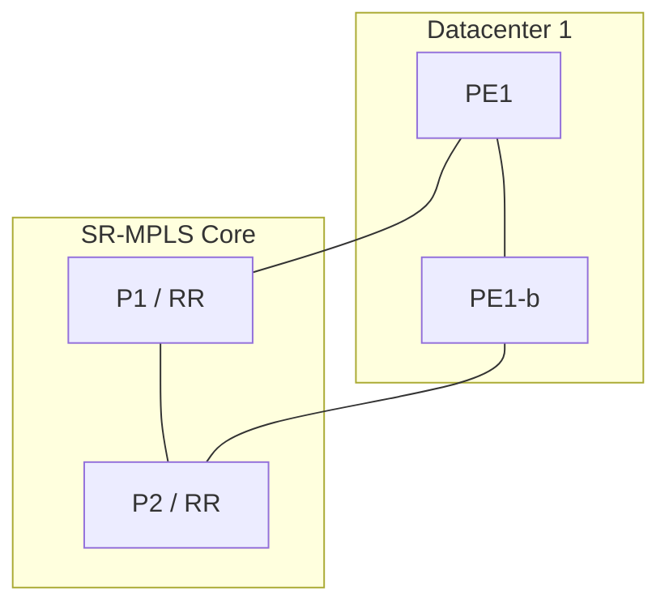

# Topology Diagram

Produce a clear reference topology. Default to **Mermaid** — it renders inline in Markdown deliverables
and needs no external tool. Show **roles, redundancy, and failure domains**, not just boxes and lines.

## Two ways

**A — Write Mermaid directly** (preferred for most diagrams). Use `graph TD` / `graph LR`:


**B — Generate from a spec** (for larger or repeatable topologies). Write a JSON spec and run the helper:
```
python .claude/skills/topology-diagram/scripts/to_mermaid.py spec.json > topology.mmd
```
Spec shape:
```json
{
  "direction": "TD",
  "groups": {"Core": ["P1", "P2"], "DC1": ["PE1", "PE2"]},
  "nodes": {"P1": "P1 / RR", "PE1": "PE1"},
  "edges": [["PE1","P1"], ["PE2","P2"], ["P1","P2","iBGP RR mesh"]]
}
```

## Discipline
- Label roles (P, PE, RR, CE, spine, leaf) and redundancy pairs.
- Make failure domains visible (subgraphs per site/DC).
- For migrations, produce **before** and **after** diagrams.

Embed the Mermaid block directly in the HLD/LLD deliverable so it renders for the reader.
