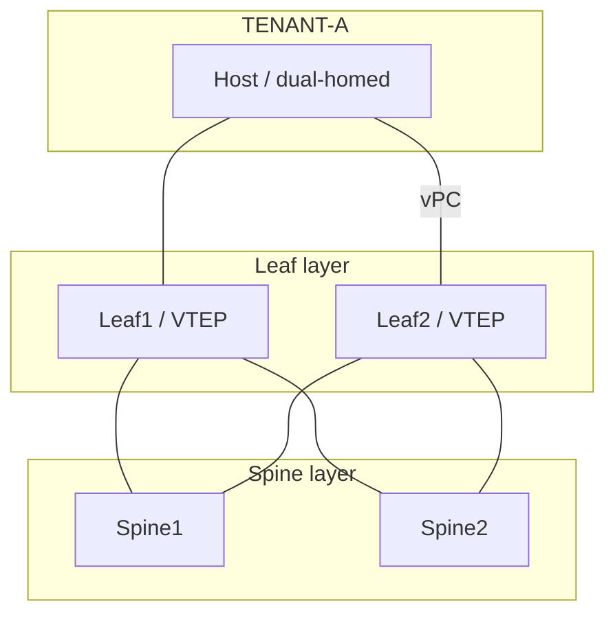

# HLD — Acme DC EVPN-VXLAN fabric

> Phase: Design · Agent: designer-hld · Skill: hld-generator · Critic: ACCEPT (after fixes)

## Recommended architecture (trade-offs — House Rule 1)
| Option | Verdict |
|---|---|
| **Spine-leaf, VXLAN with BGP-EVPN control plane, OSPF underlay, ingress-replication** | ◄ recommend — standards-based (RFC 7432 EVPN, RFC 8365 VXLAN), distributed anycast gateway, no STP in the fabric, scales east-west |
| Spine-leaf VXLAN with multicast (PIM) BUM | rejected — adds a multicast underlay to operate for no benefit at this scale |
| Legacy 3-tier + FabricPath / classic STP | rejected — the fragility and VLAN sprawl we're replacing |

## Why
BGP-EVPN gives a scalable, vendor-portable control plane (host MAC/IP advertised as EVPN routes,
type-2/type-5), **distributed anycast gateway** (every leaf is the default gateway — optimal east-west
forwarding, seamless mobility), and clean multi-tenancy via L2VNI (per-segment) + L3VNI (per-VRF) with
RT-based import/export. Ingress-replication handles BUM over BGP — **no multicast to run**.

## Security designed in (House Rule 5)
Per-tenant VRF isolation (PCI segmentation), strict CoPP on every switch, SSH-only management in a
dedicated VRF, and anycast-gateway MAC consistency to prevent gateway spoofing.

## Reference topology (auto-generated — roles, redundancy, failure domains)

## Decision log
- Underlay **OSPF** area 0, p2p, jumbo 9216 (resolved Q1).
- BUM via **ingress-replication / BGP** (resolved Q2).
- Overlay **iBGP L2VPN-EVPN**, spines as route-reflectors, ASN 65001, update-source loopback0.
- **Open (Critic HIGH, carried to LLD):** confirm the platform/line-card supports the target VTEP scale at jumbo MTU before quoting.
